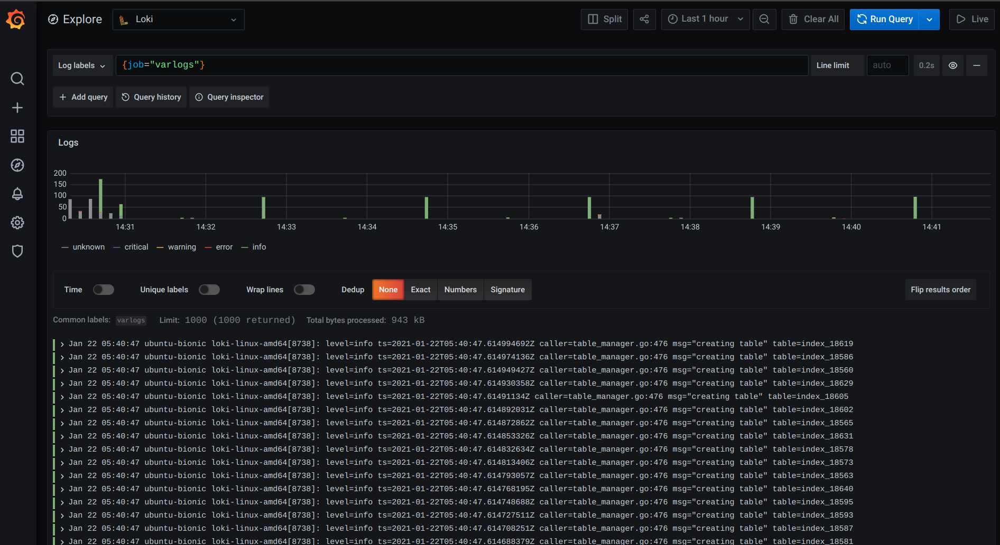
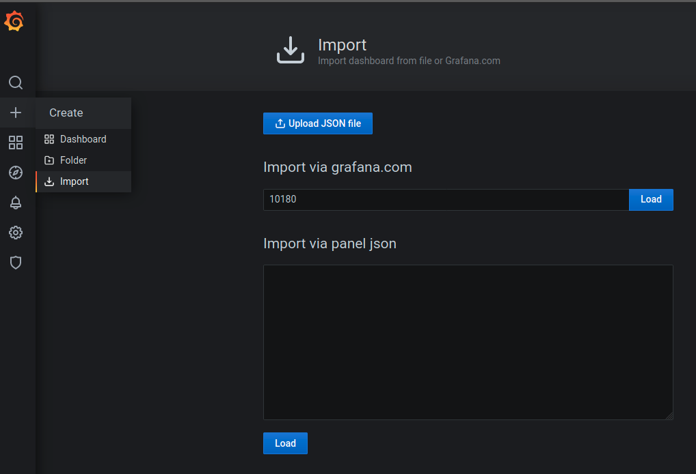
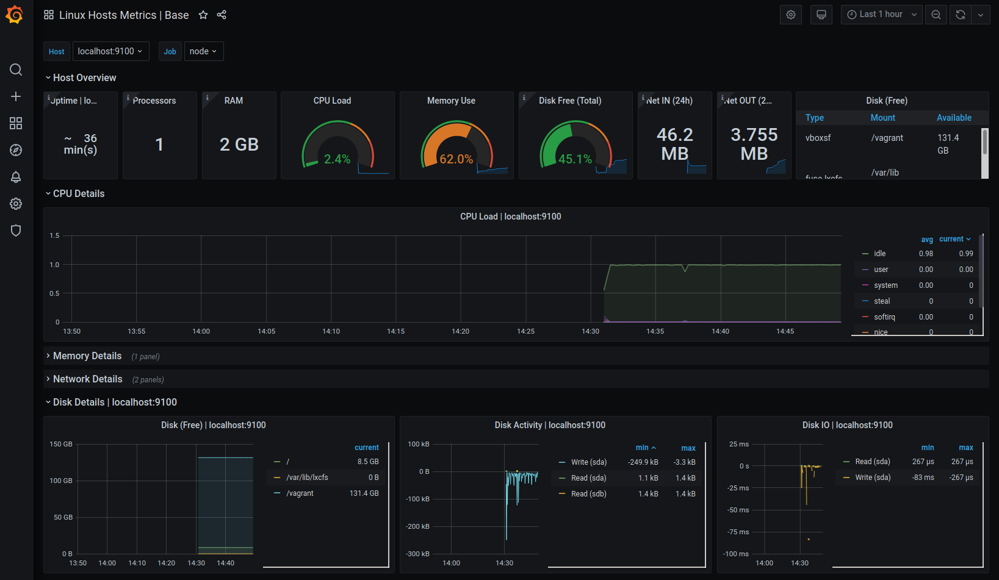

### Installing Prometheus, Grafana, Loki, Promtail via ansible-playbook
1. Install pre requirements

        sudo apt-get install -y ansible
        ansible-galaxy install cloudalchemy.prometheus
        ansible-galaxy install cloudalchemy.grafana
        ansible-galaxy install cloudalchemy.node-exporter
        ansible-galaxy collection install community.grafana

2. Fix IP in hosts.yml if needed "on-premise" instead VM
3. Run VM in vagrant

        vagrant up
3. Run playbook

        ansible-playbook grafana-on-premise.yml
4. Check Loki

[varlogs link](http://192.168.99.99:3000/explore?orgId=1&left=%5B%22now-1h%22,%22now%22,%22Loki%22,%7B%22expr%22:%22%7Bjob%3D%5C%22varlogs%5C%22%7D%22%7D%5D)

5. Add dashboard

